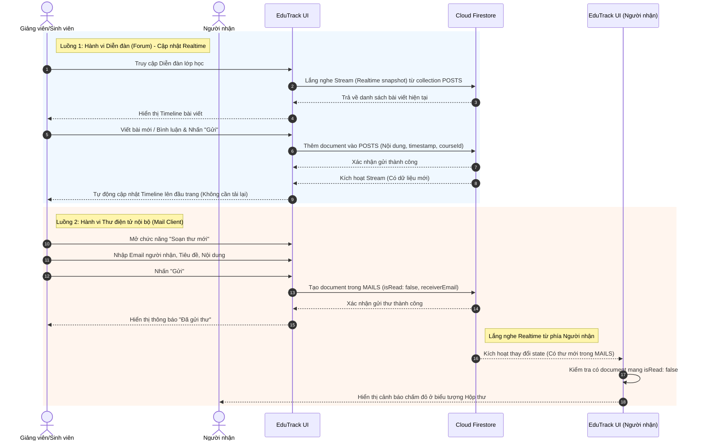

# 4.6.3. Sơ đồ Tuần tự (Sequence Diagram) - Phân hệ Hệ thống Giao tiếp: Diễn đàn & Thư điện tử

Dưới đây là sơ đồ tuần tự thể hiện chi tiết 2 luồng xử lý chính của phân hệ Giao tiếp nội bộ (Diễn đàn và Thư điện tử):
1. **Luồng hoạt động của Diễn đàn (Forum):** Thể hiện khả năng viết bài mới và tự động cập nhật dữ liệu (Timeline) theo thời gian thực dựa trên luồng dữ liệu (Stream) của Firestore.
2. **Luồng hoạt động của Thư điện tử nội bộ (Mail):** Thể hiện việc gửi thư giữa các tài khoản EduTrack và hệ thống cảnh báo thư mới chưa đọc (Chấm đỏ).

