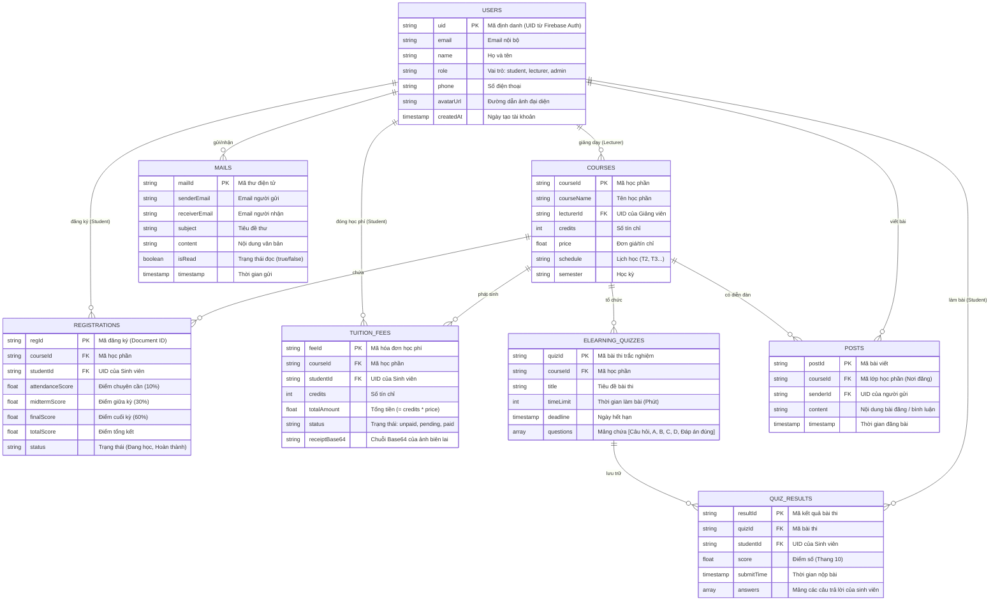

# Sơ đồ Thực thể - Liên kết (Entity-Relationship Diagram) - EduTrack Database (Firestore NoSQL)

Dưới đây là sơ đồ thiết kế cơ sở dữ liệu (ERD) thể hiện cấu trúc các Bộ sưu tập (Collections) và sự liên kết giữa các thực thể trong hệ thống EduTrack. Mặc dù sử dụng Cloud Firestore (NoSQL), chúng ta vẫn có thể ánh xạ và liên kết chúng thông qua các khóa ngoại (Foreign Keys) như `uid`, `courseId`, `studentId`, `lecturerId`.

### Chú thích:
- `PK` (Primary Key): Khóa chính định danh tài liệu trong Collection.
- `FK` (Foreign Key): Tham chiếu đến một tài liệu ở Collection khác để thiết lập mối quan hệ.
- Mặc dù đây là CSDL NoSQL (Cloud Firestore), sơ đồ ERD vẫn giúp hình dung rõ sự phân bổ dữ liệu và mối quan hệ logic giữa các thực thể, hỗ trợ cho việc thiết kế các truy vấn (`where`, `orderBy`).
