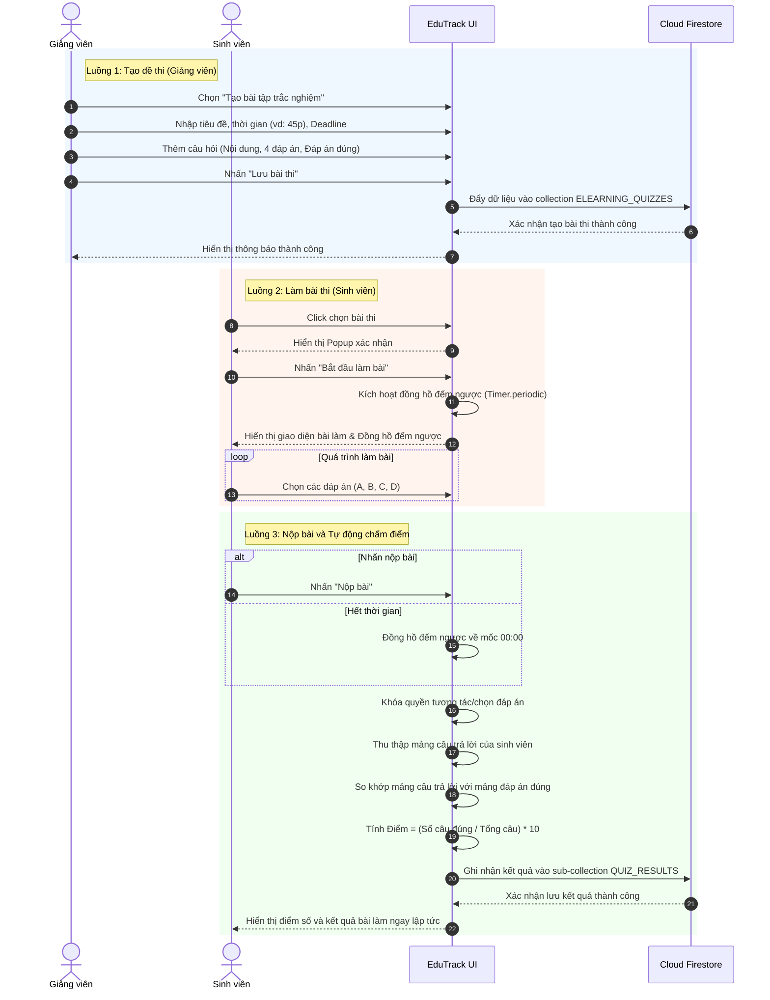

# 4.5.3. Sơ đồ Tuần tự (Sequence Diagram) - Phân hệ E-Learning & Làm Bài kiểm tra

Dưới đây là sơ đồ tuần tự thể hiện chi tiết 3 luồng xử lý chính của phân hệ E-Learning & Làm bài kiểm tra:
1. **Luồng tạo đề thi:** Giảng viên khởi tạo bài trắc nghiệm với thời gian, câu hỏi và đáp án.
2. **Luồng làm bài thi:** Sinh viên bắt đầu làm bài với đồng hồ đếm ngược được kích hoạt.
3. **Luồng nộp bài và tự động chấm điểm:** Hệ thống thu thập bài làm, so khớp đáp án, tính điểm và lưu kết quả.

