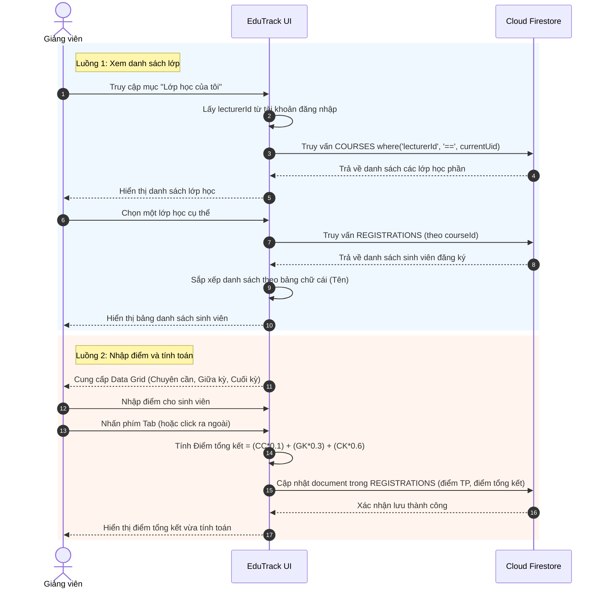

# 4.4.3. Sơ đồ Tuần tự (Sequence Diagram) - Phân hệ Quản lý Lớp học & Nhập Điểm

Dưới đây là sơ đồ tuần tự thể hiện chi tiết 2 luồng xử lý chính của phân hệ Quản lý Lớp học và Nhập điểm dành cho Giảng viên:
1. **Luồng xem danh sách lớp:** Giảng viên xem các lớp được phân công và danh sách sinh viên trong một lớp cụ thể.
2. **Luồng nhập điểm:** Giảng viên nhập điểm thành phần, hệ thống tự động tính điểm tổng kết và cập nhật dữ liệu lên Firestore.

