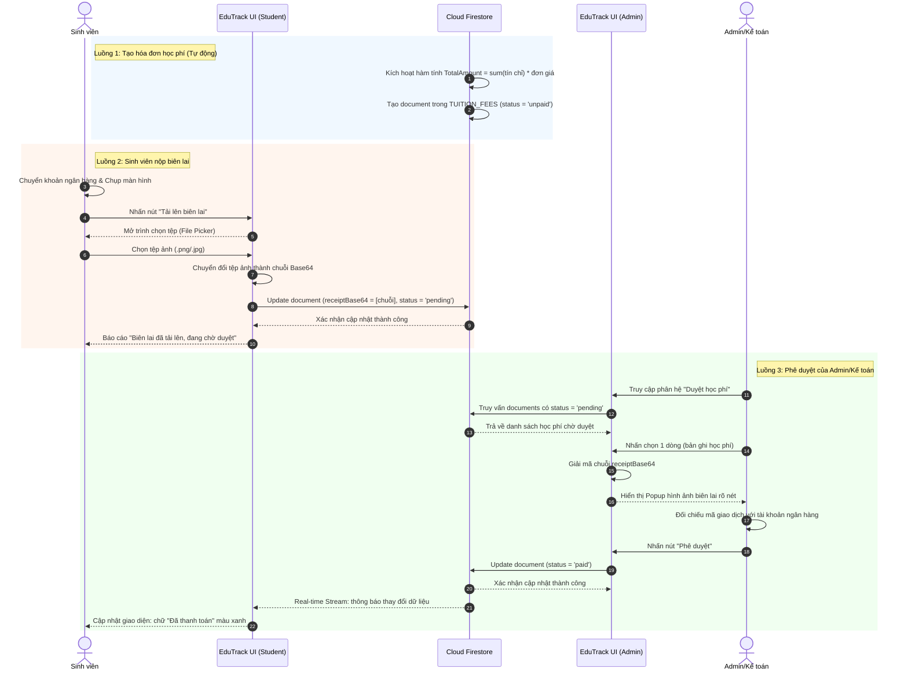

# 4.3.3. Sơ đồ Tuần tự (Sequence Diagram) - Phân hệ Quản lý & Thanh toán Học phí

Dưới đây là sơ đồ tuần tự thể hiện chi tiết 3 luồng xử lý chính của phân hệ Quản lý và Thanh toán học phí:
1. **Luồng tạo hóa đơn:** Hệ thống tự động tính học phí và tạo bản ghi sau khi sinh viên đăng ký môn học.
2. **Luồng nộp biên lai:** Sinh viên tải ảnh biên lai, ứng dụng chuyển thành chuỗi Base64 và lưu lên Cloud Firestore.
3. **Luồng phê duyệt:** Kế toán xem ảnh biên lai đã giải mã, đối chiếu và phê duyệt. Trạng thái cập nhật realtime tới sinh viên.

