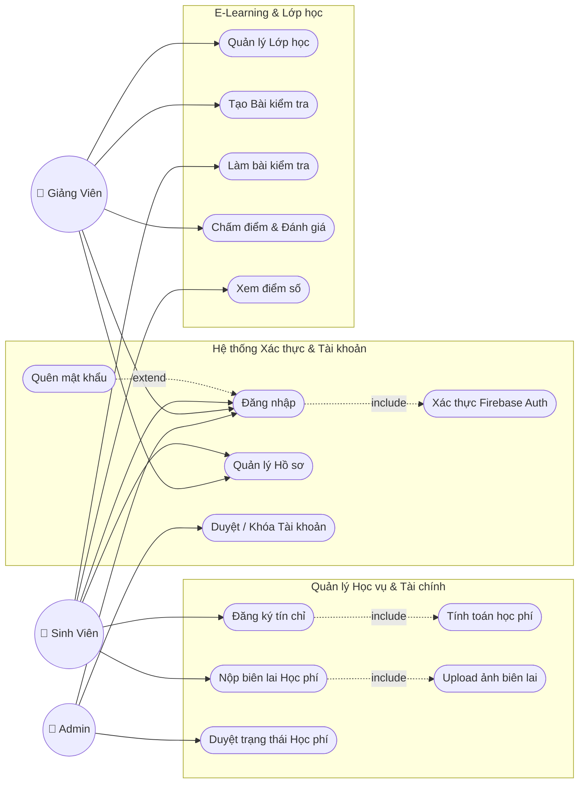

# Sơ đồ Use Case Chi tiết - EduTrack
Copy đoạn code bên trong khối mermaid (không lấy dòng ` ```mermaid ` và ` ``` `) rồi dán vào draw.io > Extras > Edit Diagram (Mermaid).


```mermaid
flowchart LR
    Student(("👤 Sinh Viên"))
    Lecturer(("👤 Giảng Viên"))
    Admin(("👤 Admin"))

    subgraph PKG1 ["Hệ thống Xác thực & Tài khoản"]
        UC1(["Đăng nhập"])
        UC2(["Quản lý Hồ sơ"])
        UC3(["Xác thực Firebase Auth"])
        UC4(["Quên mật khẩu"])
        UC5(["Duyệt / Khóa Tài khoản"])
        UC1 -.->|include| UC3
        UC4 -.->|extend| UC1
    end

    subgraph PKG2 ["Quản lý Học vụ & Tài chính"]
        UC6(["Đăng ký tín chỉ"])
        UC7(["Tính toán học phí"])
        UC8(["Nộp biên lai Học phí"])
        UC9(["Upload ảnh biên lai"])
        UC10(["Duyệt trạng thái Học phí"])
        UC6 -.->|include| UC7
        UC8 -.->|include| UC9
    end

    subgraph PKG3 ["E-Learning & Lớp học"]
        UC11(["Quản lý Lớp học"])
        UC12(["Tạo Bài kiểm tra"])
        UC13(["Làm bài kiểm tra"])
        UC14(["Chấm điểm & Đánh giá"])
        UC15(["Xem điểm số"])
    end

    Student --> UC1
    Student --> UC2
    Student --> UC6
    Student --> UC8
    Student --> UC13
    Student --> UC15

    Lecturer --> UC1
    Lecturer --> UC2
    Lecturer --> UC11
    Lecturer --> UC12
    Lecturer --> UC14

    Admin --> UC1
    Admin --> UC5
    Admin --> UC10
```
