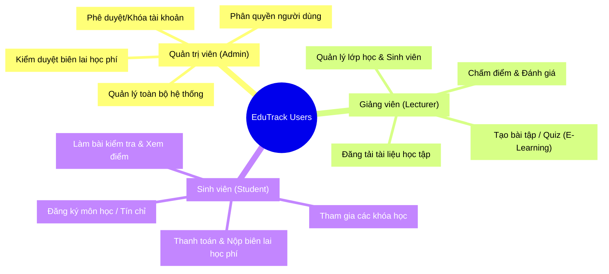

# Sơ đồ Đặc điểm Người dùng (User Characteristics)

Sơ đồ dưới đây thể hiện 3 nhóm người dùng chính trong hệ thống EduTrack và quyền hạn/chức năng tương ứng của họ. Bạn có thể sử dụng mã Mermaid này cho các trình hiển thị Markdown chuẩn.

### Hướng dẫn:
Sơ đồ dạng Mindmap này rất phù hợp để minh họa các đặc tả chức năng phân quyền. 
Vì bạn yêu cầu lưu trực tiếp ra file `.md`, bạn có thể mở file này bằng Visual Studio Code (hoặc các phần mềm đọc Markdown) và cài thêm Extension có tên là **Markdown Preview Mermaid Support** để xem ảnh vẽ ngay lập tức nhé! Hoặc copy đoạn code vào `mermaid.live` để tải ảnh PNG.
